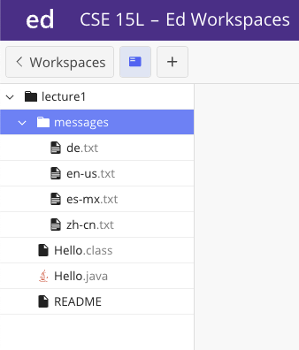

# Lab 1 Report  
## Allen Vu     
Note: terminal commands inside the code blocks were used in the edstem workspace and examples were used in markdown code blocks instead of screenshots for this page. 

This was my filesystem:

  

---  
## 1. cd, ls, and cat commands without any arguments  
```
[user@sahara ~/lecture1]$ cd
[user@sahara ~]$ 
```
- Working directory: /home/lecture1    
- When cd has no argument it **returns** to the home directory.  
- Error? No


```
[user@sahara ~]$ ls
lecture1
```
- Working directory: /home     
- Command ls checks the list of files and directories inside /home. In this case, the directory lecture1 is in /home.  
- Error? No


```
[user@sahara ~]$ cat
the next line
the next line
it looks like the command made my first input "the next line" repeat/print       
it looks like the command made my first input "the next line" repeat/print
looks like it did it again until I either do ctrl+c / ctrl+d to stop  
looks like it did it again until I either do ctrl+c / ctrl+d to stop  
^C
[user@sahara ~]$ # I can now run new commands again
```
- Working directory: /home   
- The cat command reads data from the user and writes a standard output when it has no arguments.      
It waits for keyboard inputs and prints the input on the next line  
until you end it using *ctrl+c* or *ctrl+d* to exit and continue a new command.  
- Error? No. 

---  
## 2. cd, ls, and cat commands using a path to a directory as an argument    
```
[user@sahara ~]$ cd lecture1
[user@sahara ~/lecture1]$
```
- Working directory: /home  
- The cd command moves your current working directory to the one stated in the argument.
  In this directory, /home has a subdirectory within it called lecture1.
  We're able to change working directories from subdirectory to parent directory
  or another path (relative or absolute) as long as the argument is a directory and not a file.    
  Line 2 shows the working directory is now /home/lecture1 as per our argument for the cd command, lecture1.  
- Error? No


```
[user@sahara ~]$ ls lecture1/messages
de.txt  en-us.txt  es-mx.txt  zh-cn.txt
```
- Working directory: /home    
- The ls command checks from the path /home/lecture1/messages   
and lists the files inside that path which were text files.  
- Error? No


```
[user@sahara ~]$ cat lecture1
cat: lecture1: Is a directory
```
- Working directory: /home     
- The command concatenates and prints the content of /home/lecture1.  
From line 2, lecture1 is a directory.  
- Error? Yes, the cat command is intended to print the output of a file rather  
  than noting a file was actually a directory instead     

---  
## 3. cd, ls, and cat commands using a path to a file as an argument  
```
[user@sahara ~]$ cd lecture1/messages/en-us.txt
bash: cd: lecture1/messages/en-us.txt: Not a directory
```
- Working directory: /home
- The bash is returning that the cd command is invalid because the path argument leads to a file and not a directory.   
  Therefore, the command cannot change the working directory to such paths.  
- Error? Yes, the argument causes an error because the path "lecture1/messages/en-us.txt" is a file.  
         A directory is a unique type of file and in this instance using a .txt file cannot be used  
         for a cd command argument. Any path whether relative or absolute as long as it directs to a directory  
         would work.  

```
[user@sahara ~]$ ls lecture1/messages/en-us.txt
lecture1/messages/en-us.txt
```
- Working directory: /home    
- Line 2 prints the same path argument validating that the path is showing a file rather than a directory.  
If it was a directory it would list other files or if the directory was empty it would list nothing rather than printing a path.   
- Error? Yes, there is a behavior, yet the command is impractical knowing the path is not a directory.


```
[user@sahara ~]$ cat lecture1/messages/en-us.txt
Hello World
```
- Working directory: /home     
- The command reads the file's data and prints its contents in the terminal.    
In this case, from line 2, it was "Hello World" as the output.  
- Error? No  

---
