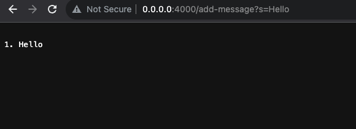
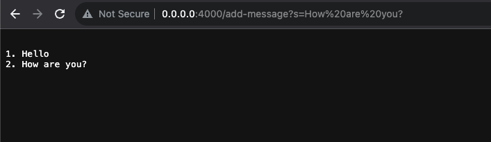
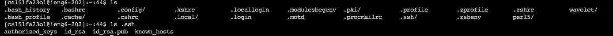
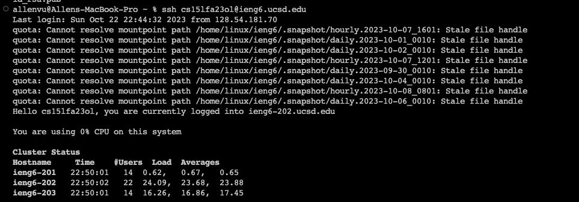

# Lab 2 Report  
## Allen Vu     

## Part 1  
Code:  
```
import java.io.IOException;
import java.net.URI;

class Handler implements URLHandler {
    // modified a template from lab2 wavelet NumberServer.java
    String single = ""; // the single string that'll be concatenated
    int addCounter = 0; // list counter

    public String handleRequest(URI url) {
        if (url.getPath().equals("/")) {
            return single; // outputs the list (this is the homepage)
        } else {
            if (url.getPath().contains("/add-message")) {
                String[] parameters = url.getQuery().split("="); // used to split string values to an array (after query parameters only)
                if (parameters[0].equals("s")) {
                    addCounter++; // new number
                    single += "\n" + addCounter + ". " + parameters[1]; // concatenate
                    return single; // outputs the list
                }
            }
            return "404 Not Found!";
        }
    }
}

class StringServer {
    public static void main(String[] args) throws IOException {
        // argument check for port range
        if(args.length == 0){
            System.out.println("Missing port number! Try any number between 1024 to 49151");
            return;
        }
        // parse the string argument into an integer data
        int port = Integer.parseInt(args[0]);
        // call from Server.java
        Server.start(port, new Handler()); 
    }
}


```
  
- *Which methods in your code are called?*  
  A: public String handleRequest(URI url) was called.  
- *What are the relevant arguments to those methods, and the values of any relevant fields of the class?  
  A: a uniform resource identifier (URI) was an argument, an integer and string field was needed for the Handler class and its methods.*   
- *How do the values of any relevant fields of the class change from this specific request? If no values got changed, explain why.*  
  A: if the request follows the designated query (/add-message?s=<string>) in the updated URI,  
  the integer field increments to count the list     
  and the <string> is added as another word on the site.    
  
  
  
- *Which methods in your code are called?*  
  A: public String handleRequest(URI url) was called.  
- *What are the relevant arguments to those methods, and the values of any relevant fields of the class?  
  A: a uniform resource identifier (URI) was an argument, an integer and string field was needed for the Handler class and its methods.*   
- *How do the values of any relevant fields of the class change from this specific request? If no values got changed, explain why.*  
  A: if the request follows the designated query (/add-message?s=<string>) in the updated URI,  
  the integer field increments to count the list     
  and the <string> is added as another word on the site.     

---  
## Part 2  
  
- The path to the private key for my SSH key for logging into ieng6:
```
/Users/allenvu/.ssh/id_rsa.pub 
```
  
 
- The path to the public key for my SSH key for logging into ieng6:  
```
~/cs15lfa23ol@ieng6-202/.ssh/id_rsa.pub
```  

- A terminal interaction where you log into ieng6 with your course-specific account without being asked for a password.  

---
## Part 3  
*In a couple of sentences, describe something you learned from the lab in week 2 or 3 that you didn’t know before.*  
A: Something I didn't know before was how easily accessible you're able to connect to a remote server.  
   The SSH (Secure Shell) command requires only the hostname, username, and password to connect to a remote computer  
   and control/access files from a local one. A more secure way to log in is using SSH keys which is an access credential  
   where sharing your local public SSH key and transferring a secure copy will create an automatic communication  
   without needing to enter a password.  
   
