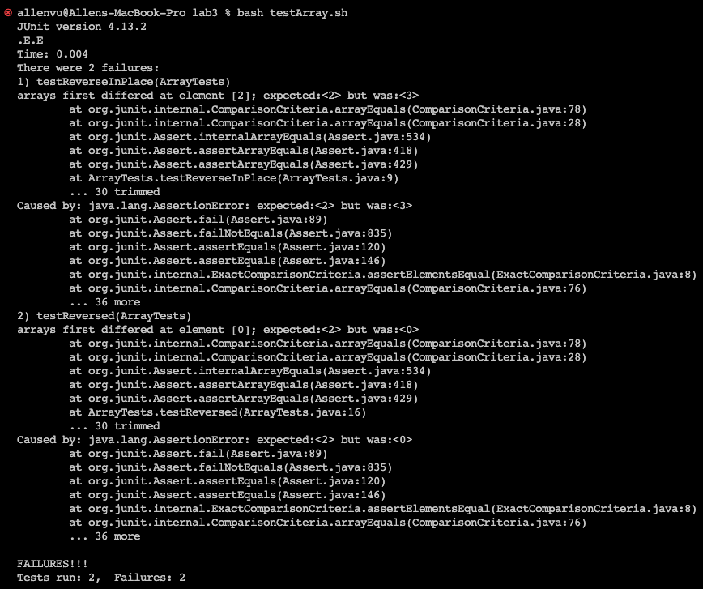

# Lab 3 Report  
## Allen Vu     

---  
## Part 1 - Bugs
* `One of the bugs from Week 4's lab:` ArrayExamples.java and ArrayTests.java    
* `A failure-inducing input for the buggy program, as a JUnit test and any associated code`  
```
public class ArrayTests {
	@Test 
	public void testReverseInPlace() {
    int[] input1 = {1, 2, 3, 4}; // failure-inducing input
    ArrayExamples.reverseInPlace(input1);
    assertArrayEquals(new int[]{4, 3, 2, 1}, input1);
	}


  @Test
  public void testReversed() {
    int[] input1 = {1, 2}; // failure-inducing input
    assertArrayEquals(new int[]{2, 1}, ArrayExamples.reversed(input1));
  }
}
```  
* `An input that doesn't induce a failure, as a JUnit test and any associate code`    
```
import static org.junit.Assert.*;
import org.junit.*;

public class ArrayTests {
	@Test 
	public void testReverseInPlace() {
    int[] input1 = { 3 }; // NOT a failure-inducing input
    ArrayExamples.reverseInPlace(input1);
    assertArrayEquals(new int[]{ 3 }, input1);
	}


  @Test
  public void testReversed() {
    int[] input1 = { }; // NOT a failure-inducing input
    assertArrayEquals(new int[]{ }, ArrayExamples.reversed(input1));
  }
}
```  
* `The symptom, as the output of running the tests`    
  
* `The bug (code before fix)`  
```
public class ArrayExamples {

  // Changes the input array to be in reversed order
  static void reverseInPlace(int[] arr) {
    for(int i = 0; i < arr.length; i += 1) {
      arr[i] = arr[arr.length - i - 1];
    }
  }

  // Returns a *new* array with all the elements of the input array in reversed
  // order
  static int[] reversed(int[] arr) {
    int[] newArray = new int[arr.length];
    for(int i = 0; i < arr.length; i += 1) {
      arr[i] = newArray[arr.length - i - 1];
    }
    return arr;
  }

}
```  
* `The correction for the bug (fixed code)`    
```
public class ArrayExamples {

  // Changes the input array to be in reversed order
  static void reverseInPlace(int[] arr) {
    int[] temp = new int[arr.length];
    for (int i = 0; i < arr.length; i++) {
      temp[i] = arr[i];
    }
    for(int i = 0; i < arr.length; i += 1) {
      arr[i] = temp[arr.length - i - 1]; 
    }
  }

  // Returns a *new* array with all the elements of the input array in reversed
  // order
  static int[] reversed(int[] arr) {
    int[] newArray = new int[arr.length];
    for(int i = 0; i < arr.length; i += 1) {
      // arr[i] = newArray[arr.length - i - 1]; // me: removed og line via comment
      newArray[i] = arr[arr.length - i - 1]; // me: added this
    }
    return newArray; // me: modified from arr to newArray
  }

}
```  
* `Briefly describe why the fix addresses the issue.`  
  A: The two algorithms for swapping the position of an array was initially faulty due to  
     having a bug such that the test program's failure-inducing input caused it to have symptoms (terminal behavior) of producing a failure result on the JUnit tests rather than an OK result. First, the reverseInPlace() method needed another way of keeping a current index's data before it gets swapped otherwise it gets overwritten and no other data keeps track of it. I chose to use a temporary array that copies the original array and then the the temp array can swap the original array while not losing any integer at each index (algorithm does take more space complexity but patches the bug). The second method reversed() required changes updating between the old array and new array so I assigned the new array to update using the old array unlike the unfixed which did the opposite. Fixing the two methods and running the JUnit test again, the terminal was able to produce OK results for both test methods therefore no symptoms had resulted from the failure-inducing inputs.  

     ---
     ## Part 2 - Researching Commands  
     `Command to explore:` grep  
     1.


