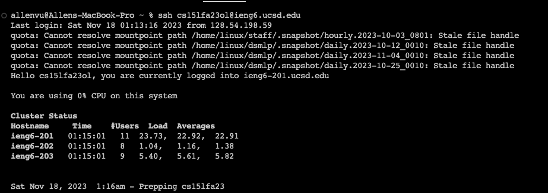
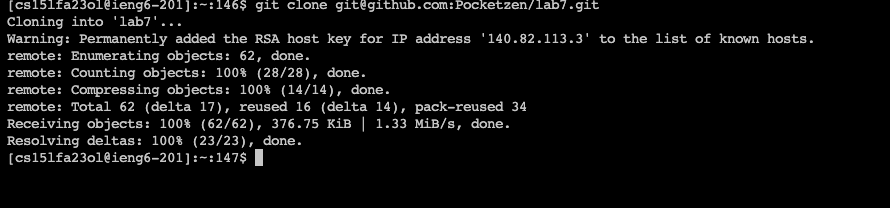
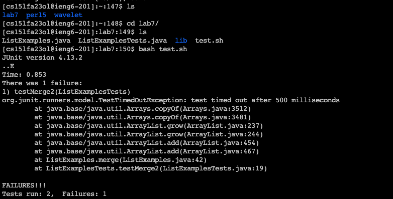
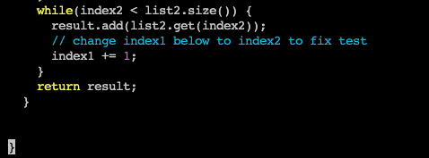
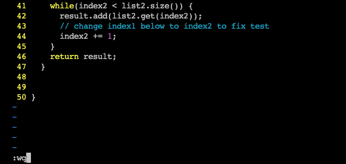
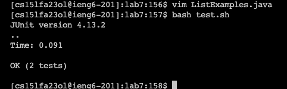
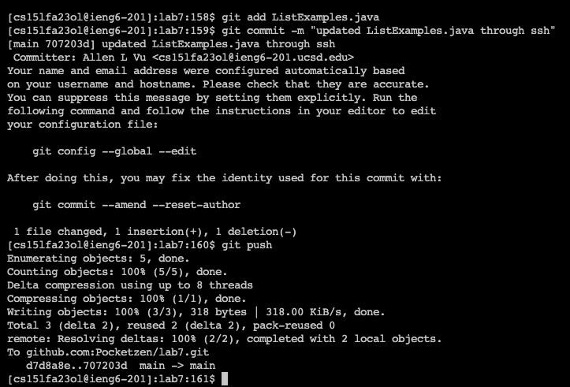
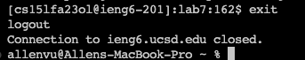

# Lab Report 4  
## Allen Vu     
 
## Vim and SSH
---
  
keys pressed: `ssh cs15lfa23__@ieng6.ucsd.edu`\<enter> command to login to ieng6 
---
---  
  
keys pressed: `git clone git@github.com:Pocketzen/lab7.git`\<enter> command to clone my repository onto ieng6 
---   
---  
  
keys pressed: use `ls` command to locate repository directory then `cd l`\<tab> results  
in `cd lab7/` command to change current directory to target directory  
`ls` again to check specifi name contents of repository then `bash t`\<tab> results  
`bash test.sh`\<enter> which runs the JUnit commands in the bash script.  
Test initially results in a fail due to a bug in ListExamples.java 
---   
---  
  
keys pressed: `vim L`\<tab> results to `vim ListExamples`<.>\<tab>  
results to `vim ListExamples.java`\<enter> command  
to open vim and enter the java file.   
---  
---  
  
keys pressed: none  
just locating where the edit should be made  
---  
---  
  
keys pressed: \<shift>\<g> to go to the end of file, \<esc> to go back to normal mode  
`:set number` to display line number in vim then <6>\<k>\<e>\<x>\<i><2>\<esc> to move to index1 and change it to index2 then go back to normal mode then lastly `:wq` to save and exit.  
---  
---  
  
keys pressed: \<up>\<up>\<enter> to reuse `bash test.sh` command  
which was 2 up in the search history  
lastly, the test has now outputed passed results.  
---  
---  
  
keys pressed: `git add ListExamples.java`\<enter>`git commit -m "updated ListExamples.java through ssh`\<enter>`git push`\<enter> to git add, git commit, and git push commands to GitHub.
git add move the individual file ListExamples.java to the staging area  
git commit to actualize/snapshot the staging area for version history  
git push to update ieng server repository to remote repository to GitHub    
---  
---  
  
keys pressed: `exit`\<enter> to exit and close ssh connection.      
---

