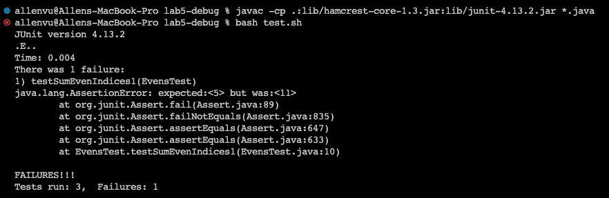
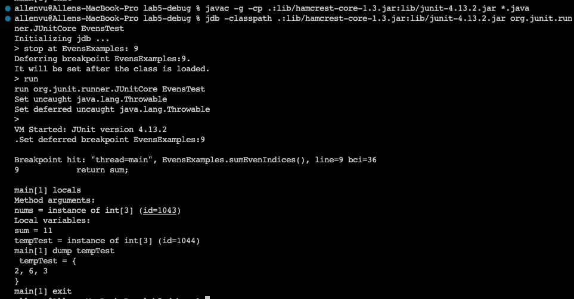
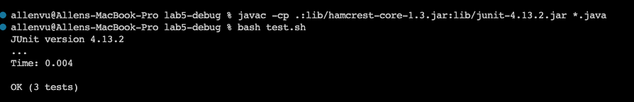

# Lab Report 5  
## Allen Vu     

## Part 1 -- Debugging Scenario
---  
## Bug in Code for Summation of Strictly Even Indices #312
   
**Anonymous**: I can't seem to find the bug in my code for the summation of an array of even indices only. The failure inducing-input was {2, 6, 3} and I believe my algorithm is adding more than what is stated since my result was 11 instead of 5 during the JUnit assert. I've attached my setup and here are the symptoms attached below:    
  
&nbsp;   
**Allen (TA)**: Looking at your setup, it looks like you've made 3 tests in EvensTest.java where 2 have passed and 1 tests has not. You could look into skimming the debug error above from JUnit or you could also consider utilizing JDB. Commands to start setting up JDB following your directoy are:  
```
javac -g -cp .:lib/hamcrest-core-1.3.jar:lib/junit-4.13.2.jar *.java 
jdb -classpath .:lib/hamcrest-core-1.3.jar:lib/junit-4.13.2.jar org.junit.runner.JUnitCore EvensTest
```  
**Anonymous**: I was able to set JDB but I don't know where to go besides knowing that the values are different from one. Where should I try locating?  
&nbsp;    
**Allen (TA)**: You could try checking how each iterations of sum are added during each iteration. Clearly, your 2 other tests passed due to not having failure-inducing inputs. Your first test for the FII where {2, 6, 3} can be checked for each iteration using jdb. An instance in doing this can be creating an array in your loop that keeps check for each iteration where sum is also simulataneously added. So when your variable "sum" is getting update, update a data that can hold what sum is holding so which data structure can hold each changes of the tested inputs so you can see the changes? Useful commands in JDB should be creating breakpoints where we can locate the changes of sum for the FII test.  
&nbsp;  
**Anonymous**: Thank you, I think the hunch of my algorithm adding to much is because I clumsily forgot to omit the iteration where the algoirthm accessed odd indices which is ironic. I chose to use an array to keep a parallel count in response to every new change of variable "sum" and I used the command `>stop at EvensExamples:9`,`>run`, and `>dump testTemp` in JDB to detail more about the bug where I traced back to the conditions of my loop in the algorithm. I had to change `i++` to `i+=2`  in the for loop of my code so the bug was a update counter error. Here is my results using the suggested commands and the passed test after running the bash script again!  
  
   

## Setup in the Q/A:  
Directory Structure (. is the working directory where it's called "lab5-debug" for this setup)  
```
./EvensTest.java
./EvensExamples.class
./EvensTest.class
./EvensExamples.java
./lib
./lib/junit-4.13.2.jar
./lib/hamcrest-core-1.3.jar
./test.sh
```

test.sh  
```
javac -cp .:lib/hamcrest-core-1.3.jar:lib/junit-4.13.2.jar *.java
java -cp .:lib/hamcrest-core-1.3.jar:lib/junit-4.13.2.jar org.junit.runner.JUnitCore EvensTest
```
EvensTest.java  
```
import static org.junit.Assert.*;
import org.junit.*;

public class EvensTest {
    @Test 
	public void testSumEvenIndices1() {
    int[] input1 = {2, 6, 3};
    int output1 = EvensExamples.sumEvenIndices(input1);
    int expect1 = 5;
    assertEquals(expect1, output1);
	}

    @Test 
	public void testSumEvenIndices2() {
    int[] input2 = {1};
    int output2 = EvensExamples.sumEvenIndices(input2);
    int expect2 = 1;
    assertEquals(expect2, output2);
	}

    @Test 
	public void testSumEvenIndices3() {
    int[] input3 = {};
    int output3 = EvensExamples.sumEvenIndices(input3);
    int expect3 = 0;
    assertEquals(expect3, output3);
	}
}
```
EvensExamples.java (w/ bug)  
```
public class EvensExamples {
    static int sumEvenIndices(int[] nums) {
        int sum = 0;
        for (int i = 0; i < nums.length; i++) {
            sum += nums[i];
        }
        return sum;
    }
}
```  
EvensExamples.java (changes for JDB use / not fixed yet)  
```
public class EvensExamples {
    static int sumEvenIndices(int[] nums) {
        int sum = 0;
        int[] tempTest = new int[nums.length]; // temp test to hold sum history for debug
        for (int i = 0; i < nums.length; i++) {
            sum += nums[i];
            tempTest[i] = nums[i];
        }
        return sum;
    }
}
```
EvensExamples.java (fixed)  
```
public class EvensExamples {
    static int sumEvenIndices(int[] nums) {
        int sum = 0;
        for (int i = 0; i < nums.length; i += 2) {
            sum += nums[i];
        }
        return sum;
    }
}
```  
All listed commands to find the bug:  
```
javac -g -cp .:lib/hamcrest-core-1.3.jar:lib/junit-4.13.2.jar *.java
jdb -classpath .:lib/hamcrest-core-1.3.jar:lib/junit-4.13.2.jar org.junit.runner.JUnitCore EvensTest
> stop at EvensExamples: 9
> run
> locals
> dump tempTest
> exit
```
Description to fix the bug:   
In EvensExamples.java, you needed to change the iteration i++ to i += 2.  
```
Before: for (int i = 0; i < nums.length; i++) {} // change i++
After: (int i = 0; i < nums.length; i += 2) {} // fixed: i += 2
```  

---  
## Part 2 -- Reflections  
*In a couple of sentences, describe something you learned from your lab experience in the second half of this quarter that you didn’t know before. It could be a technical topic we addressed specifically, something cool you found out on your own building on labs, something you learned from a tutor or classmate, and so on. It doesn’t have to be specifically related to a lab writeup, we just want to hear about cool things you learned!*  
&nbsp;  
A: From someone who's main way of debugging is through agressive print statements, learning how to access and use a genuine debugging tool was an experienece I never knew I actually needed. Albeit I might not be a fan of JDB it's useful how it can be similar to other debuggers for other languages and programming paradigms as well. Other concepts about the logitics of Git (how the staging works) and the importance of knowing Vim was definitely really eye-opening with the class's emphassi about learning useful software tools and techniques. OVerall for a novice and student, the class was definitely eye-opening and interesting.
